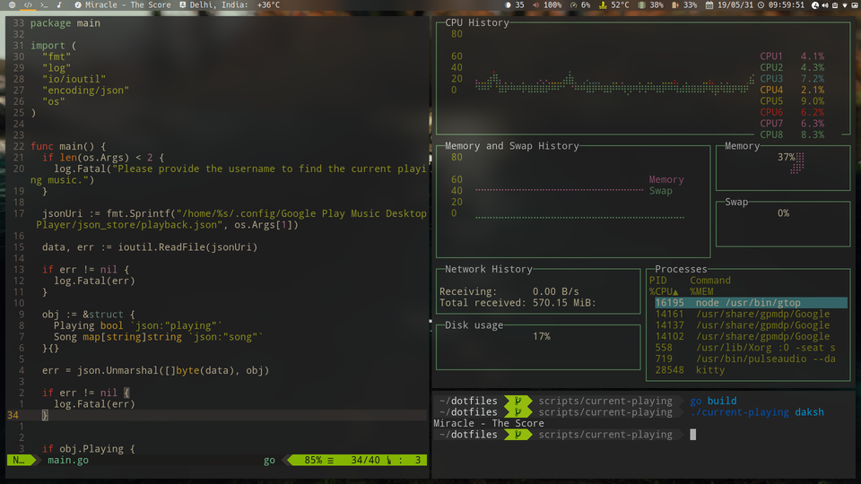

Hello There, My name is Daksh Miglani. I'm a programmer with a passion for math and business.

I work at [Adler AI Inc](https://adler.ai), Where we provide _APIs for Deep Learning Models_. Our most notable clients include _KPMG, Duff & Phelps, Bank of Karnataka_.

### My life

I've been writing code since I was 9 years old and I've spent almost all my life sitting right infront of a computer, laptop or a Cell Phone. I'm from Generation-Z (currently 18 years old).

My go-to stratergy for learning almost anything and everything I know is the hit and trial method, I keep trying and improving up on my failures, which is also another reason why I love sharing and discussing what I've learnt so that I can learn even more by getting other opinions.

My life has always been very different than most of my peers, and most of my experiences are very crazy yet fascinating, some notable examples:

1. Getting my first full time job as a Product Engineer at age of 16.
2. Winning multiple college level hackathons.
3. The average age group of my friend group is `28` (28.16 to be exact, crazy right?)
4. Running a startup with `> 100 clients`.
5. ...I've a lot more of these facts, but there should be some secrecy, right eh?

I am currently following a road not taken, a path despised, hated, not supported by many and this is why I'm so thankful to my dad, who has been so much supportive in this, who has helped me navigate a lot of challenges, allowed me to follow my passion and not force me to fit in a generalized box. I love you dad <3.

I also have a very supportive and a very caring lover, who even after knowing that I was at the blink of failure stayed with me, and helped me a lot through the daily bullets and challenges I faced! Love ya a lot babe <3.

As well as thanks to my good old classmate, who still struck with me and helped me a lot during the times of trouble.

### Work

I have notable experience in:

- Building Scalable Systems using Microservices (Containerized Applications)
- Databases (replication and transactions)
- Building and Serving Deep Learning Models for Production
- Building a CI / CD First Development Environment
- Managing Linux Servers
- Serverless / Cloud Functions
- API Gateways

My Favourite Programming Languages are:

I have experience with many programming languages and have worked with a lot of them, but this list emphasizes the ones I most enjoy working with:

- TypeScript (especially with Node.js)
- Python
- Go
- (currently learning) Rust

My Current Interests are:

- Math
- Quantum Computing
- High Frequency &amp; Algo-Trading

### FAQs:

#### What Operating System do you use?

> I tend to use ArchLinux with the latest kernel time to time, but I'm currently trying Pop_OS!

#### What editors do you use?

> I primarly use NeoVim and VSCode (that too with vim bindings).

#### What Desktop Environment / Window Manager do you use?

> I use i3-gaps, my desktop looks something like:

#### What font do you prefer?

> The font of my preference is Fira Code.

#### Do you have dotfiles?

> Of-course, I do! You can find them [here](https://github.com/DakshMiglani/dotfiles).

#### Gitlab or Github?

> Gitlab.
